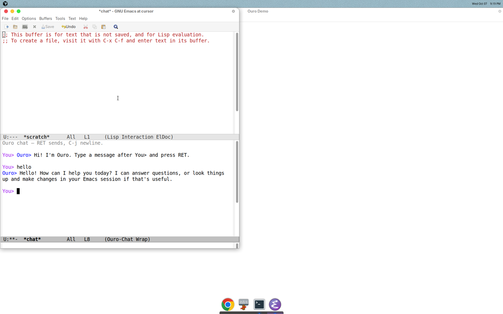
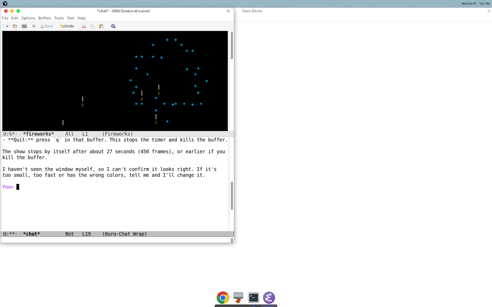

<p align="center">
  
</p>

<h1 align="center">Ouro</h1>

Minimal agent harness: one LLM request, one round of eval. The agent bootstraps by redefining `agent-prompt` into a real loop.

Needs Docker and `ANTHROPIC_API_KEY` in the environment.

### Demo

Bootstrap into a chat, say hello, then ask Ouro to build a fireworks tool — [watch the demo](media/ouro-demo.mp4):

<video src="media/ouro-demo.mp4" controls width="720"></video>

<p align="center">
  
  
</p>

### Step 1

Start the Emacs container:

```bash
docker run -dit --name boot-emacs --platform linux/amd64 \
  -e ANTHROPIC_API_KEY -e LANG=C.UTF-8 --entrypoint bash silex/emacs
```

### Step 2

Copy the harness in:

```bash
docker cp boot.el boot-emacs:/boot.el
```

### Step 3

Bootstrap the agent:

```bash
docker exec -it boot-emacs emacs -nw --no-splash -l /boot.el \
  --eval '(agent-boot "Build a chat interface so the user can talk with you in this Emacs.")'
```
