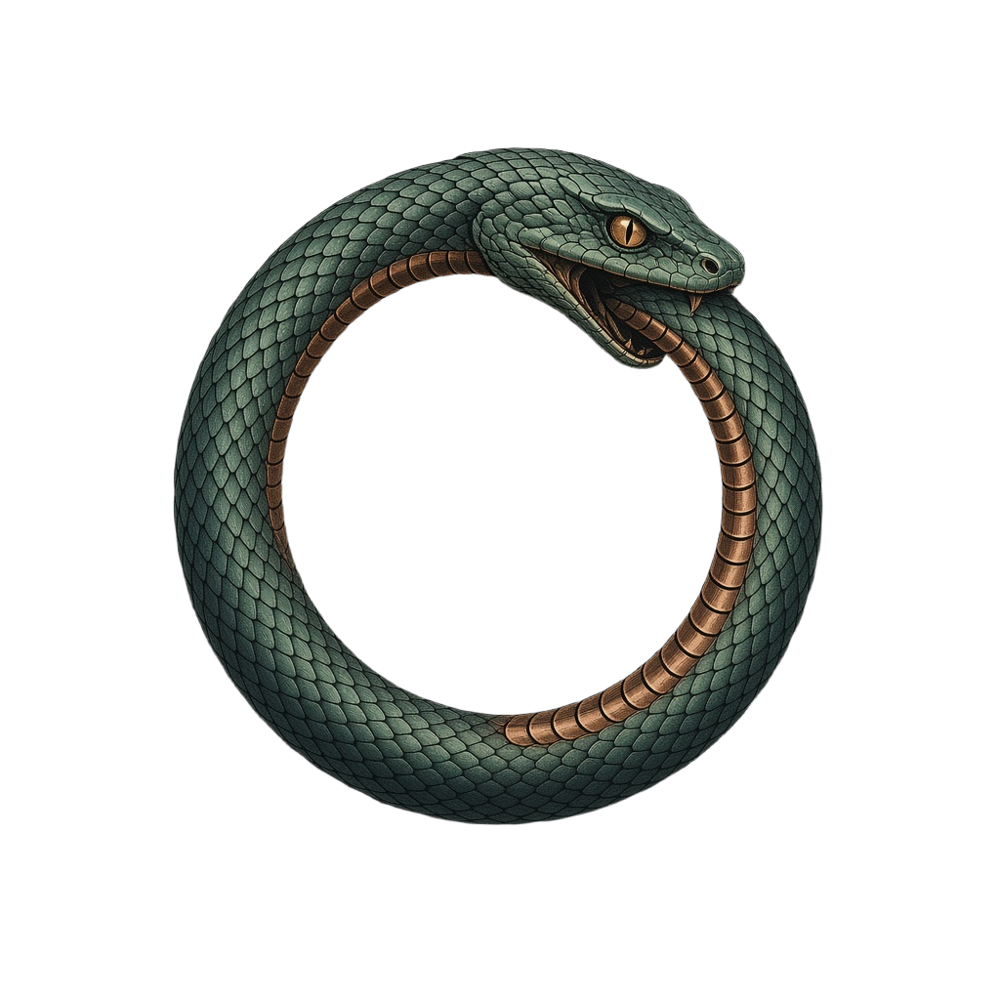

<p align="center">
  
</p>

<h1 align="center">Ouro</h1>

Ouro. The Last Harness ([essay](https://dtornow.github.io/ouro/ouro-the-last-harness/)). Minimal agent harness: one LLM request, one round of eval. The agent bootstraps by redefining `agent-prompt` into a real loop.

Needs Docker and `ANTHROPIC_API_KEY` in the environment.

### Step 1

Start the Emacs container:

```bash
docker run -dit --name boot-emacs --platform linux/amd64 \
  -e ANTHROPIC_API_KEY -e LANG=C.UTF-8 --entrypoint bash silex/emacs
```

### Step 2

Copy the harness in:

```bash
docker cp boot.el boot-emacs:/boot.el
```

### Step 3

Bootstrap the agent:

```bash
docker exec -it boot-emacs emacs -nw --no-splash -l /boot.el \
  --eval '(agent-boot "Build a chat interface so the user can talk with you in this Emacs.")'
```

# The pit of snakes

Ouro, ported to other environments:

- [ouro-python](https://github.com/renerocksai/ouro-python) by [renerocksai](https://github.com/renerocksai)  
  Python
- [ouro-nvim](https://github.com/renerocksai/ouro-nvim) by [renerocksai](https://github.com/renerocksai)  
  Neovim, Lua
